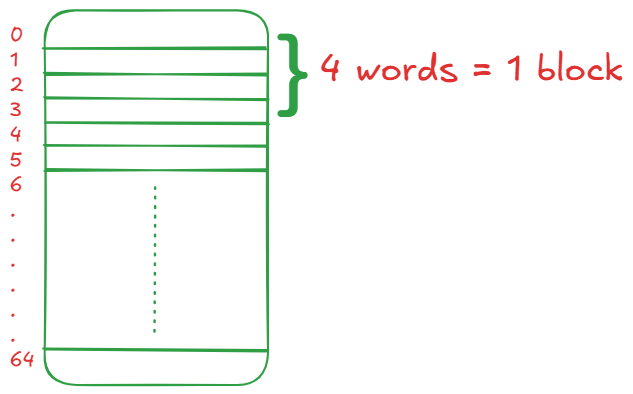
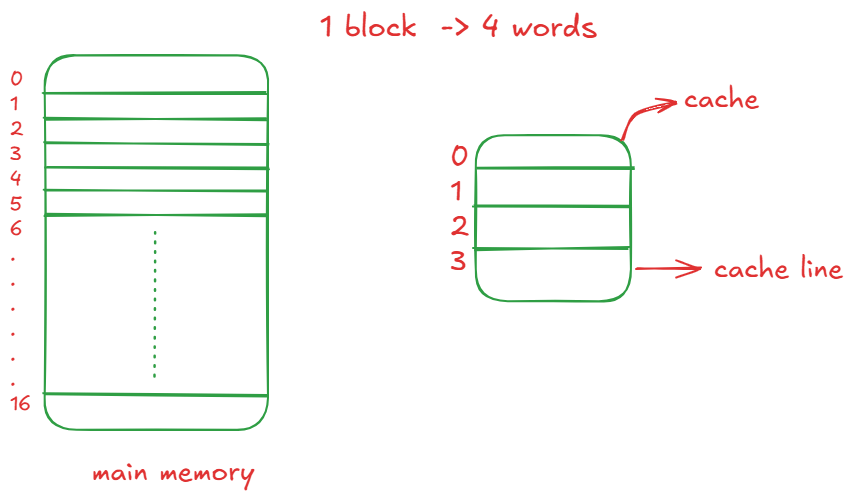
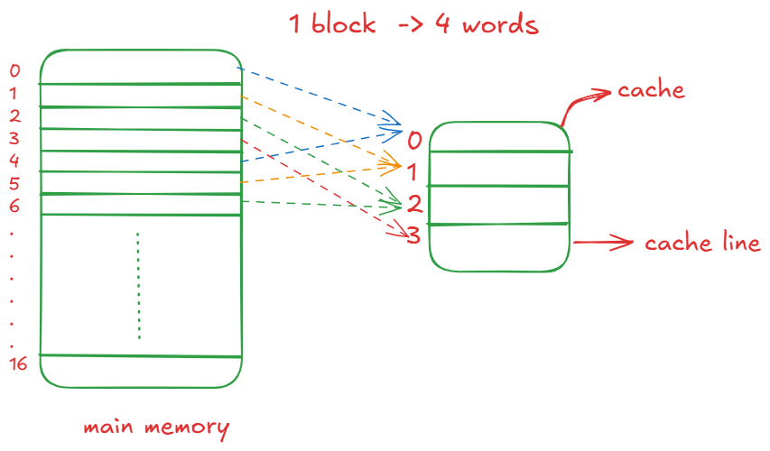
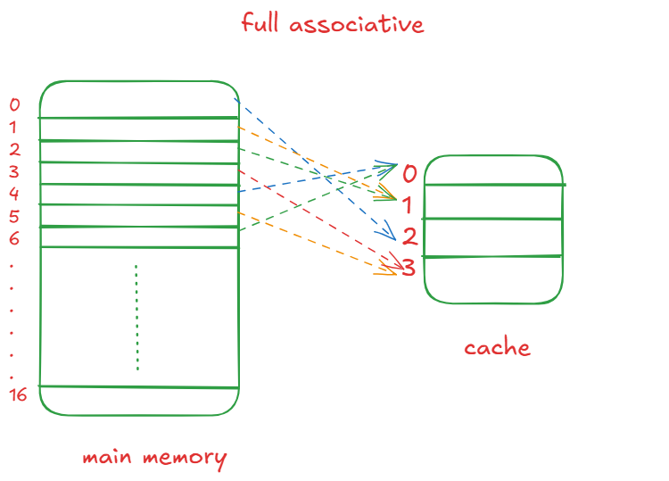
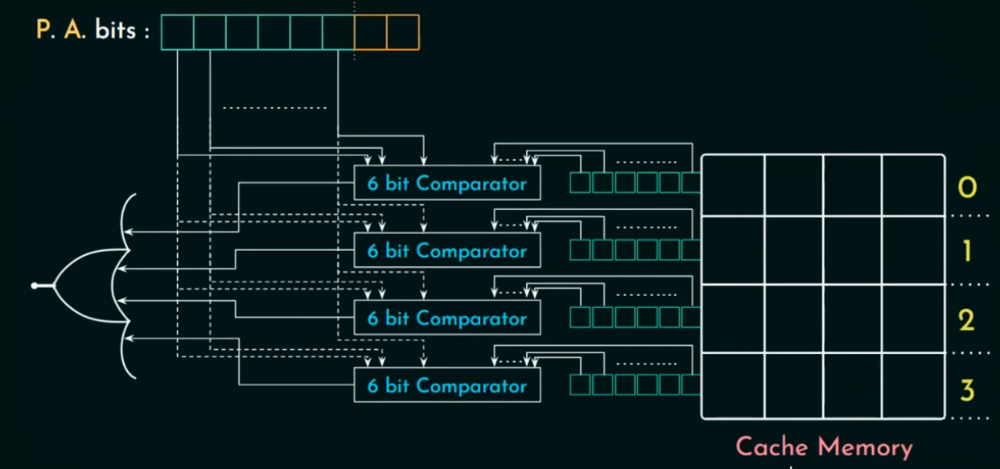
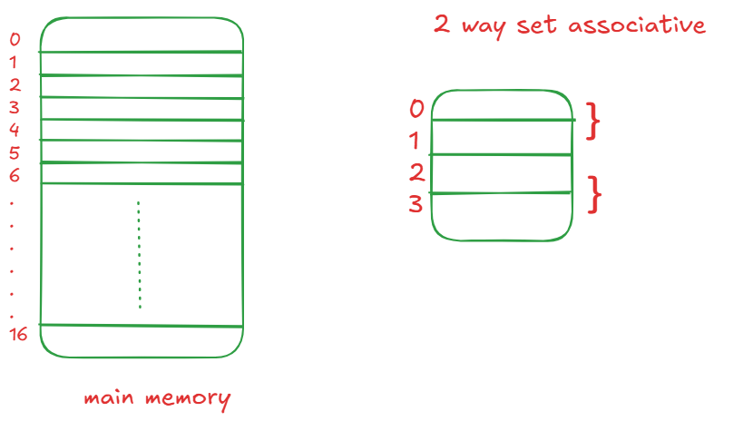

# Cache  


To begin with, cache is faster — even more than main memory — because of the architecture: **SRAM (cache)** and **DRAM (main memory)**. Also, it is inside the CPU, which makes it much faster.  

**L1** is in each core, **L2** is also per core but a bit bigger, and **L3** is big and shared among all cores.

---

## How fast is cache? → **AMAT (Average Memory Access Time)**  

**AMAT = hit time + (miss rate × miss penalty)**  

Although it might seem obvious:

**AMAT = hit rate × hit time + (1 − hit rate)(hit time + miss time)**

This translates into:  
If the desired data is there → it takes **hit time**.  
If it is not there → it takes **hit time** (to check cache) + **miss time** (main memory access).

---

## How does storing in cache work?

It works on two principles:

### **Temporal locality** (the for-loop stuff)

If you access something, you’re bound to access it again.

```c
// Same variable reused repeatedly
int sum = 0;
for (int i = 0; i < 1000; i++) {
    sum += i;
}
```

The variable `sum` stays in cache because it is repeatedly accessed in a short time span.

---

### **Spatial locality**

If you access something at an address, you’re likely to access something nearby (array example).

```c
// Sequential array access
int arr[1000];
for (int i = 0; i < 1000; i++) {
    arr[i] = i;
}
```

Since arrays are stored in *contiguous memory*, accessing `arr[i]` makes it very likely that `arr[i+1]` is already in the same cache block.

---

Due to these principles, the minimum unit of data transferred between cache and main memory is a **block** (which should be contiguous).  

The cache is divided into slots known as **cache lines**, and each cache line stores exactly one block.  

> **Block in main memory = Cache line in cache**

To select a particular byte of data, you require **log₂(block size)** → gives the **offset bits**.  
To select a particular cache line, it is **log₂(number of cache lines)** → gives the **index bits**.

This looks similar to:

`Tag | Index | Offset`

---

## Direct Mapping



In the above example, we have 64 memory locations. Assume block size as 4 memory words. Each block gets assigned a particular slot, later on.  

We take:

**block number % 4**




Tag bits help distinguish between which memory block is actually stored in that slot and also help during replacement if not found.  

For example, {0, 4, ...} are mapped to 0 similarly {1, 5, ..} are mapped to 1 in cache.

But to know which of the blocks {0, 4, ..} is stored in 0th cache slot, **tag bits are used**.


### Disadvantage → **Conflict Miss**

Multiple memory blocks map to the same cache location even though cache may have empty space elsewhere.

---

## Associative / Fully Associative Mapping

To avoid conflict miss, the blocks can now be mapped to **any cache line**.



Although this prevents conflict misses, the comparison cost is high.  
Since the address is now divided into only two parts (**tag + offset**), every tag must be compared. *N* cache lines will have *N* comparators



---

## Set Associative Mapping

A hybrid of both direct and associative mapping, where cache blocks are grouped into **sets**.  

A particular set of blocks in main memory can be mapped to any cache line within the assigned set.

If a set contains **k cache lines**, it is called **k-way set associative**.  

It still needs **k comparators**, though.



**Direct mapping** has only **1 comparator**, because it just needs to compare *single record* of tag bits - because *index bits* determine the exact cache line, while in set associative *index bits* determine set of cache line and each contains **k cache lines** for **k - way set associative**, therefore **K comparators**