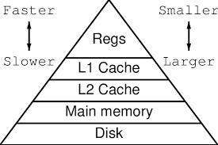

# Multi-Level Cache — The Real Game Begins

Cache is very small in size.

To compensate for the small size while still keeping efficiency high, we use **multi-level cache** .

L3 – fast  
L2 – faster  
L1 – fastest  

Each level is:
- smaaaaller than the previous one  
- Slightly faaster than the previous one  

Hierarchy:

CPU → L1 → L2 → L3 → Main Memory  

“Higher level” means **closer to CPU**, not bigger number.

So:
- L1 = highest level cache  
- L2 = lower level  
- L3 = even lower  

---

## How Fast is Multi-Level Cache?

**Single-Level Cache**

AMAT (Average Memory Access Time):

$AMAT = Hit Time + Miss Rate × Miss Penalty$

similarly

**Multi-Level Cache**

Now the miss opens another door.

$AMAT = HT₁ + MR₁ × (HT₂ + MR₂ × (HT₃ + MR₃ × Miss Penalty))$

Interpretation:

- Try L1  
- If miss → try L2  
- If miss → try L3  
- If miss → main memory 
- if miss -> *gg's* 

---

## What Data is Stored in L1, L2, L3?

duplicate blocks? Or each level store completely different data?

To answer this, we define:

- Inclusive Cache  
- Exclusive Cache  
- Non-Inclusive (Non-Inclusive Non-Exclusive)

---

## Inclusive Cache

$L1 ⊆ L2 ⊆ L3$

Everything in L1 must also exist in L2.  
Everything in L2 must also exist in L3.

So, duplication exists.

Important rule:

If a block is evicted from a lower level (like L2), it must also be removed in higher levels (like L1).

Because inclusion must be preserved.

If L2 removes a block and L1 keeps it, $L1 ⊆ L2$ is violated.

---

### Write-Back in Inclusive Cache

Under write-back policy:

If a dirty block is evicted from L1 → the modified data is written to L2 (not directly to memory).

If L2 later evicts it → it writes to L3 (or memory if L3 doesn’t exist).

Write-back always propagates one level down at a time.

---

## Exclusive Cache

$L1 ∩ L2 ∩ L3 = ∅$

No duplication.

A block exists in only one cache level at a time.

If L1 evicts a block, it moves to L2.

So data flows downward instead of being duplicated.

Advantage:
- Better effective cache capacity  

Disadvantage:
- More complex movement logic  

---

## Why Multi-Level Cache Exists

Because:

- L1 must be extremely fast → so it must be small  
- Large cache cannot be extremely fast  
- Memory is too slow  

So instead of choosing between size and speed,  
we stack them.

Fast and small at the top.  
Large and slow at the bottom.

