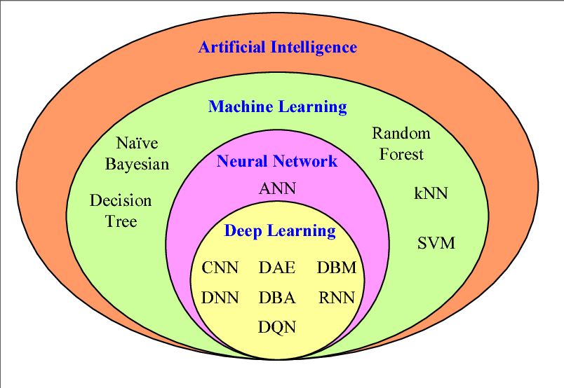
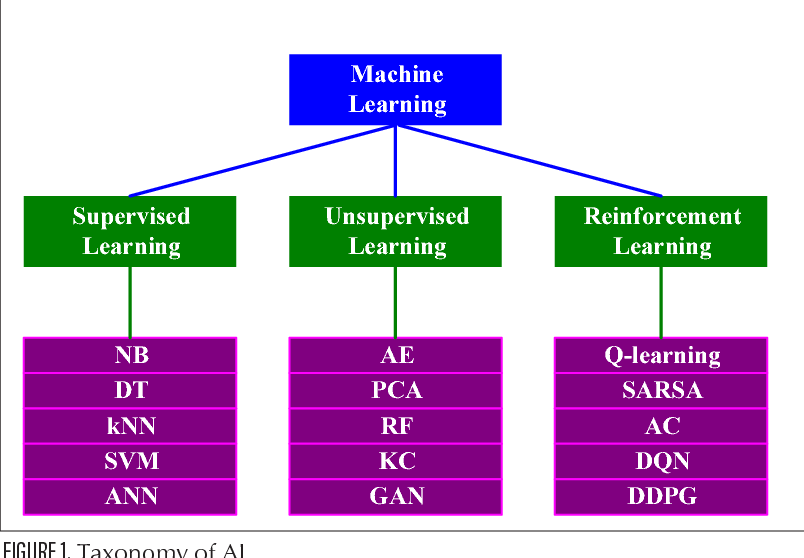

I see no direction — a lot of buzzwords are being thrown around: transformers, AI, gen AI, agentic AI shit.

To begin, what is AI?

AI, in a rough sense, means “thou who replicates kinda”.  
AI encompasses machine learning models, deep learning models, or anything and everything which kinda mimics human cognitive abilities or computation.

### Paradigm

AI’s eldest daughter: **machine learning**.

Machine learning is the process of training a machine to predict an outcome based on data.  
Based on how the data is perceived, ML is further classified into:
- supervised learning  
- unsupervised learning  
- reinforcement learning  

---

### Supervised learning

Supervised learning models are child-like. These things inherently do not possess the ability to determine the label of data — they need to be taught.

Something chocolatey-brown, rectangular is chocolate. So every time I give this model a chocolate, it would classify it as chocolate. Though sometimes it may be wrong, but that’s where learning comes in. It is okay to fail but learn from your mistakes.

Read more.

---

### Unsupervised learning

On the other hand, unsupervised learning models do not know what is input or label of data, and frankly speaking, they do not care.

Something brown — be it dirt, chocolate, poop — they do not care what they are, but well enough they can differentiate between them. They recognize patterns.

Read more.

---

### Reinforcement learning

And lastly, reinforcement learning — these little dopamine-hungry twerps.

They work on the concepts of reward and punishment.  
Reward them with 2 gms of dopamine if they act as you intended, else punish them (god-like shit).

---

### Deep learning

Working on
