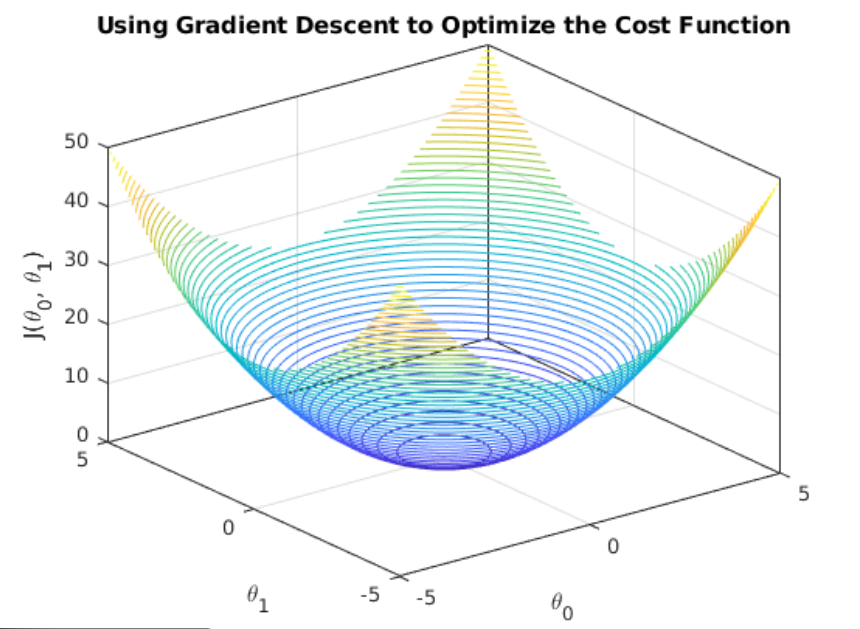

Supervised learning model works on **labeled data** for context – [Read more](../overview.md)
Fuck there are a ton of shit: **linear**, **logistic** regression, **decision** trees, random forests, **SVM**, naive bayes, KNN (I find him sus)

Let’s start slow: **linear regression**.

If I had to know how long my relationship would last, what would I need to evaluate?  
love, trust, compatibility, humour, respect.

Although these might seem intangible attributes, being a very very rational person, I will **quantize** it.

Let  

$$
y_{relationship} = b_0 + b_1x_{love}  +  b_2x_{trust}  +  b_3x_{compatibility}  +  b_4x_{humour}  +  b_5x_{respect}
$$

$y_{relationship}$ = denotes how long the relationship will last  
$b_0$ = represents bias when love, trust, comp etc. are 0  
$b_i$ = coefficients indicating how much influence each independent factor has on the output

So to begin, we never know which holds the most significance, we start off random.

The error/cost function (average squared error) is given by:

$$
J(b) = \frac{1}{n} \sum_{i=1}^{n} \frac{1}{2}(y_i - \hat{y}_i)^2
$$

“How do we know how much each bi contributes to the error and how do we change or update it?”

For that, we find partial differentiation of the error/cost function with the respective `b` values.  
Because differentiation gives us the slope — in other words, how little of a change in the `b` values can cause a change in the error function. It points towards the direction that increases the function (error function), and we need to reduce it.

Lol multiply by `-1` that reverses the direction.

Now we know how much a particular `b` value imposes on the error and how much we need to update it, here the **learning rate** comes into the picture.

We update parameters using gradient descent:

$$
b := b - \alpha \frac{\partial J}{\partial b}
$$

As the number of `b` values increases, it becomes more computationally expensive, so stay home stay safe.
