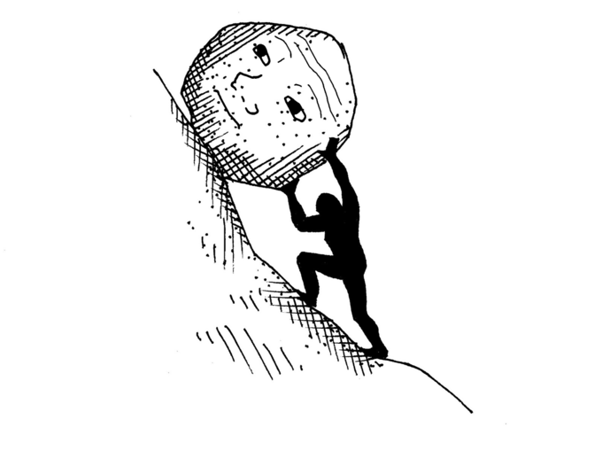
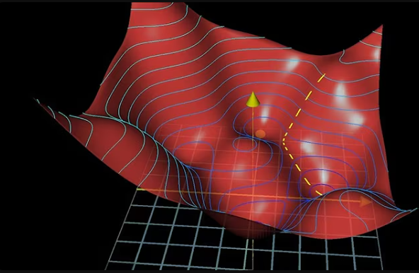

Is it because a lot of time has passed since differential calculus harassed me? It started feeling abstract. The other day when I was looking at “linear regression ML”, it had a concept called **gradient descent**.

This got me hooked.

We start from basics:

Integration → differentiation → series → limits.  
Archimedes, in the ancient era — it all began with the *method of exhaustion*, “ the first of integral calculus”.
we went too far back. let's just stick to **differential calculus**.

---

## Slope = Steepness

Slope describes *steepness*.

 

The steepness is measured between two points $(x_1, y_1)$, $(x_2, y_2)$.

An observational note: slope (or as I call it, *steepness*) is attributed to the range $(x_1, x_2)$, so:

$$
\frac{y_2 - y_1}{x_2 - x_1}
$$

is the **average rate of change** over that interval.

---

## Example

Let:

$$
d(t) = t^2 + t + 1
$$

where $t$ is time and $d(t)$ is distance as a function of time.

At $t = 2$, $d = 7$  
At $t = 3$, $d = 13$

Points:
- $A(2, 7)$
- $B(3, 13)$

Slope:

$$
\frac{13 - 7}{3 - 2} = 6
$$

This is the **average speed** between 2 and 3.

But what if I want speed at a *particular instant*?

We bring A and B so close they’re indistinguishable, but not exactly overlapping.

Let:

$$
t_1 = 2
$$

$$
t_2 = 2 + h
$$

where $h$ is very, very, very, very small almost tending to 0, but not exactly 0.

Slope becomes:

$$
\frac{d(2+h) - d(2)}{h}
$$

Compute:

$$
d(2+h) = (2+h)^2 + (2+h) + 1
$$

$$
= 4 + 4h + h^2 + 2 + h + 1
$$

$$
= 7 + 5h + h^2
$$

So,

$$
\frac{d(2+h) - 7}{h}
=
\frac{5h + h^2}{h}
=
5 + h
$$

As $h \to 0$:

$$
\text{Instantaneous speed at } t = 2 \text{ is } 5
$$

which matches:

$$
d'(t) = 2t + 1
$$

And a tangent line: $y = mx + c$ can be drawn with that slope.

Wowwww coincidenceeee.

$$
f'(x) = \lim_{h \to 0} \frac{f(x+h) - f(x)}{h}
$$

Bruh, why am I deriving this lol.

---

# Now — Gradient Descent

The error function:

$$
(y_{output} - y)^2
$$

(ignore coefficients for now) looks like an upward parabola.

$$
J(b) = (y_{output} - y)^2
$$

To know what $b$ is, -> [look here](../logs/ai/supervised/linear.md).

And it is because of $b$ that the error is occurring.

The $X$'s are innocent. They are just input variables.

*(not fully innocent.)*

---

## Partial Derivatives Enter

If we have a simple linear model:

$$
y_{output} = b_0 + b_1 x
$$

Then the cost function becomes:

$$
J(b_0, b_1) = (b_0 + b_1 x - y)^2
$$

Now we ask:

How much is **each parameter** contributing to the error?

We partially differentiate.

With respect to $b_0$:

$$
\frac{\partial J}{\partial b_0}
=
2(b_0 + b_1 x - y)
$$

With respect to $b_1$:

$$
\frac{\partial J}{\partial b_1}
=
2(b_0 + b_1 x - y)x
$$

the error function is no more a 2D parabola *(RIP)*.

It’s a *surface*.

---

## The Gradient

The gradient vector is:

$$
\nabla J =
\begin{bmatrix}
\frac{\partial J}{\partial b_0} \\
\frac{\partial J}{\partial b_1}
\end{bmatrix}
$$

This vector points in the direction of **steepest increase** of the error.

i.e trying to maximize the error function.

That’s not what we want we need to minimize.

So we multiply by $-1$.

That’s where the **descent** comes in.

---

## Update Rule

$$
b := b - \alpha \nabla J
$$

Or component-wise:

$$
b_0 := b_0 - \alpha \frac{\partial J}{\partial b_0}
$$

$$
b_1 := b_1 - \alpha \frac{\partial J}{\partial b_1}
$$

Where:

- $\alpha$ = *learning rate*
- It controls how much we are changing the $b$.

Too small → slow changes.  
Too big → drastic changes.

---

Idk if this is silly or not.

But it was fun.

Stay home. Stay safe.

---

**TL;DR**

X’s are not fully innocent.

That’s where *feature engineering* comes in.

But that’s for another day.
