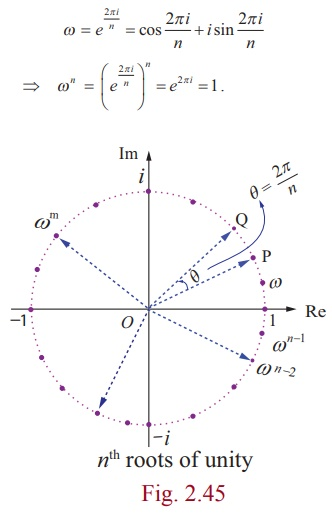

# Complex Numbers into Geometry

## The √−1

Algebra mainly dealt with solving equations, Babylonians, Greeks and so on. It was always about finding the unknown.

Then they came across something inevitable:

$$
x^2 + 1 = 0
$$

which gives

$$
x = \sqrt{-1}.
$$

No real number squares to $-1$.

These numbers felt useless and did not hold any real significance, so they thought. There was no geometric meaning for them. They were just symbols introduced to make equations work.

---

## Euler

Around the 1700s, Euler was experimenting heavily with trigonometry, logarithms and imaginary numbers. He was building upon De Moivre’s formula and pushing power series further.

Start with the exponential series:

$$
e^x = 1 + x + \frac{x^2}{2!} + \frac{x^3}{3!} + \cdots
$$

Now substitute $x = i\theta$:

$$
e^{i\theta}
= 1 + i\theta + \frac{(i\theta)^2}{2!}
+ \frac{(i\theta)^3}{3!}
+ \frac{(i\theta)^4}{4!}
+ \cdots
$$

Simplify powers of $i$:

$$
e^{i\theta}
= 1 + i\theta - \frac{\theta^2}{2!}
- \frac{i\theta^3}{3!}
+ \frac{\theta^4}{4!}
+ \frac{i\theta^5}{5!}
- \cdots
$$

Now separate real and imaginary parts:

$$
e^{i\theta}
=
\underbrace{\left(
1 - \frac{\theta^2}{2!}
+ \frac{\theta^4}{4!}
- \cdots
\right)}_{\cos\theta}
+
i\underbrace{\left(
\theta - \frac{\theta^3}{3!}
+ \frac{\theta^5}{5!}
- \cdots
\right)}_{\sin\theta}
$$

Which gives

$$
e^{i\theta} = \cos\theta + i\sin\theta.
$$

But geometrically this meant something important. Multiplication by $e^{i\theta}$ represents rotation by $\theta$. An exponential function, something that usually grows or decays, was now wrapping around a circle.

---

## Roots of Unity

Now consider

$$
z^n = 1.
$$

Write $z = e^{i\theta}$. Then

$$
e^{in\theta} = 1.
$$

Since $e^{i2\pi} = 1$, we must have

$$
n\theta = 2\pi k,
$$

so

$$
\theta = \frac{2\pi k}{n}.
$$

That gives

$$
z_k = e^{i\frac{2\pi k}{n}}, \quad k = 0,1,\dots,n-1.
$$

The solutions are equally spaced points on the unit circle. An algebraic equation produces a perfect regular polygon.

---

## Wessel

Caspar Wessel was a surveyor. His problem was practical.

If you move $a$ units east and then $b$ units north, how do you represent that direction algebraically?

He wrote

$$
a + b\mathbf{E}.
$$

Here $a$ means move east.  
$\mathbf{E}$ represents a rotation of $90^\circ$.  
Then $b$ means move in that rotated direction.

The important idea is that $\mathbf{E}$ behaves like a rotational operator.

Apply it twice:

$$
\mathbf{E}^2 = -1.
$$

That is exactly the defining property of $i$.

Wessel essentially reconstructed imaginary numbers from geometry.

<video controls>
  <source src="{{ '/assets/vids/WesselWithGrid.mp4' | relative_url }}" type="video/mp4">
</video>

---

## Argand

Argand formalized the geometric interpretation.

If positive numbers extend to the right of zero and negative numbers extend to the left, then complex numbers extend the number line into a plane.

The horizontal axis represents the real part.  
The vertical axis represents the imaginary part.

A number $a + bi$ is simply the point $(a,b)$.

Its modulus is

$$
|a + bi| = \sqrt{a^2 + b^2},
$$

and its argument is the angle it makes with the real axis.

In polar form,

$$
z = r e^{i\theta},
$$

multiplication becomes

$$
z_1 z_2 = r_1 r_2 e^{i(\theta_1 + \theta_2)}.
$$

Lengths multiply.  
Angles add.

Multiplying by $i$ rotates by $90^\circ$.

---

## Gauss

Gauss made this unavoidable through his work on the Fundamental Theorem of Algebra. Every polynomial has a root in the complex numbers.

The complex plane became foundational.

Real axis horizontal.  
Imaginary axis vertical.  

---

## Hamilton

After complex numbers worked perfectly in two dimensions, the natural question was whether something similar could exist in three.

Hamilton tried for years to extend the idea. Three components did not close algebraically.

The resolution was that you need four components.

Quaternions:

$$
q = a + bi + cj + dk,
$$

with

$$
i^2 = j^2 = k^2 = ijk = -1.
$$

Geometrically:

- $i$ corresponds to rotation about the x-axis  
<video controls>
  <source src="{{ '/assets/vids/IOperator.mp4' | relative_url }}" type="video/mp4">
</video>
- $j$ corresponds to rotation about the y-axis  
<video controls>
  <source src="{{ '/assets/vids/JOperator.mp4' | relative_url }}" type="video/mp4">
</video>
- $k$ corresponds to rotation about the z-axis  
<video controls>
  <source src="{{ '/assets/vids/KOperator.mp4' | relative_url }}" type="video/mp4">
</video>

Quaternion multiplication is not commutative:

$$
ij = k, \quad ji = -k.
$$

This reflects the fact that 3D rotations do not commute.

<video controls>
  <source src="{{ '/assets/vids/NonCommutativeDemo.mp4' | relative_url }}" type="video/mp4">
</video>

---

## Dot and Cross Inside Quaternion Multiplication

Take two pure quaternions,

$$
q_1 = a_1 i + a_2 j + a_3 k,
$$

$$
q_2 = b_1 i + b_2 j + b_3 k.
$$

Their product becomes

$$
q_1 q_2 = -(\vec{a} \cdot \vec{b}) + (\vec{a} \times \vec{b}).
$$

The scalar part is the dot product.  
The vector part is the cross product.

Dot product measures alignment/ parallelism:

$$
|\vec{a}||\vec{b}|\cos\theta.
$$

Cross product measures perpendicular/rotational interaction:

$$
|\vec{a}||\vec{b}|\sin\theta.
$$

where   $\cos\theta$   talks about *how parallel the lines are* and similarly $\sin\theta$ talk about *measure of perpendicularity*.

while, 
$$|\vec{a}||\vec{b}|
$$
represent alignment strength and rotational strength in dot cross product respectively.

