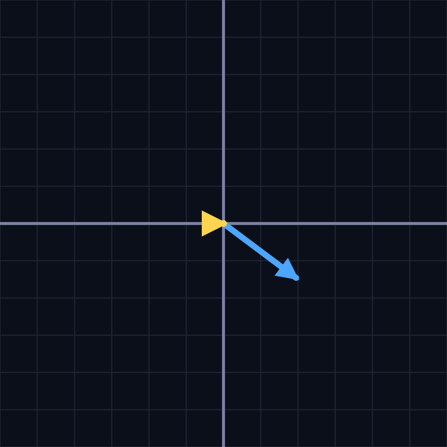

# linear algebra

  

Starting linear algebra because the normal equation in linear regression tickled my butt.

  

Although I do know matrix addition, multiplication, and determinants, everything felt abstract. I mean:

“here you go, this is how you multiply/add two matrices”,

“this is how you find the determinant of a matrix”.

I didn’t see any real context there.

  

So here we are.

  

It all began with **René Descartes**.

He found the coordinate system. On a plane of (X)–(Y) axes, shapes could now be represented:

  

$$
y^2 = 4ax
$$

  

This system evolved to observe how certain quantities change with respect to time — distance, acceleration, etc, $x(t),  a(t)$ to observe planetary movements, and that eventually gave birth to **calculus**.

Although integral calculus came much earlier, its first roots can be traced back to **Archimedes' method of exhaustion**.

  

With calculus we were able to find speed and acceleration, but we were only able to describe the **magnitude**.

We needed something to describe **direction** as well.

  

*Ta-dah* **vectors**.

  

Vector quantities: velocity, acceleration

Scalar quantities: distance, speed

  

*JEE shit.*

In a 2D space preferably the $(X\text{-}Y$) plane a vector is represented as

$$
\vec{v} = x\mathbf{i} + y\mathbf{j}
$$

<!-- add small animation: vector starts at origin → moves x along x-axis → then y upward -->

It can also be written as a column matrix:

$$
\begin{bmatrix}
x \\
y
\end{bmatrix}
$$

---

## Vector Addition (geometric view)

Vector addition looks funny geometrically:  
join the tail of one vector to the head of another, and the resultant vector is drawn from the tail of the first vector to the head of the last vector.

This simply means the second vector takes the head of the first as its reference.

Algebraically:

$$
(x_1\mathbf{i} + y_1\mathbf{j}) + (x_2\mathbf{i} + y_2\mathbf{j})
= (x_1 + x_2)\mathbf{i} + (y_1 + y_2)\mathbf{j}
$$

---

## Scalar Multiplication

Scalar multiplication just scales the vector.

$$
\vec{v} = x\mathbf{i} + y\mathbf{j}
$$

$$
2\vec{v} = 2x\mathbf{i} + 2y\mathbf{j}
$$

---

## Basis

Fun fact: every vector on a 2D plane can be represented using exactly two linearly independent vectors called **basis vectors**.

Example basis vectors:

$\begin{bmatrix}
0  \\
1 
\end{bmatrix}$, $\begin{bmatrix}
1 \\
0 
\end{bmatrix}$

*the infamous $\hat{i}$ and $\hat{j}$*

which is why when we write $\vec{v} = x\mathbf{i} + y\mathbf{j}$,
it means

$$
x
\begin{bmatrix}
1 \\
0
\end{bmatrix}
+
y
\begin{bmatrix}
0 \\
1
\end{bmatrix}
$$

---

# Transformations

Physicists wanted something more. more than changing vectors in a fixed space. they wanted to observe how a vector changes when the *space itself* changes.

**Transformation — read more**

